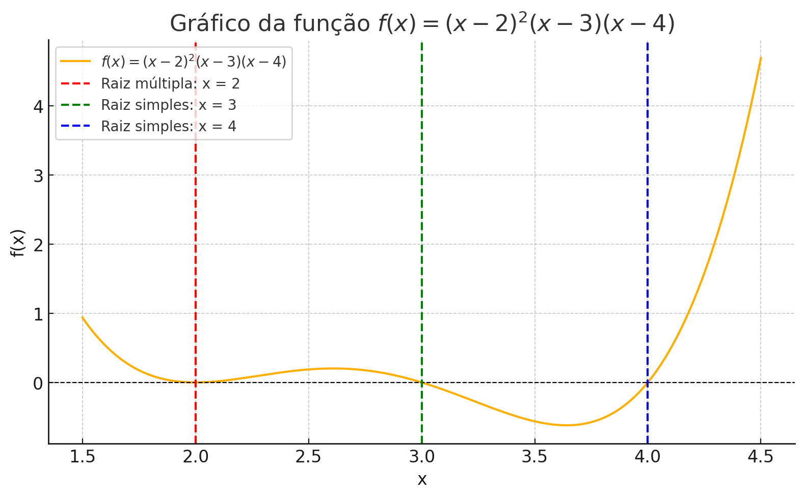

  

# Universidade de Brasília
**Departamento de Ciências Mecânicas**\
Programa de Pós-Graduação\
**Cálculo de Raízes: Newton-Raphson Modificado**\
**Disciplina: Métodos Numéricos**\
Professor: Rafael Gabler Gontijo\
Data: 2025-03-30\
**Aluno: Eng. Lucas Wanick --- Mestrando em Ciências Mecânicas**

# Introdução

A presente atividade tem como objetivo aplicar o método de
Newton-Raphson em sua versão modificada para o cálculo das raízes de uma
função polinomial com múltiplas raízes reais. Os resultados serão
analisados quanto à convergência, número de iterações e comportamento
dos erros absoluto e verdadeiro.

# Formulação Matemática

O método de Newton-Raphson é baseado na aproximação sucessiva da raiz a
partir da iteração:

$$x_{i+1} = x_i - \frac{f(x_i)}{f'(x_i)}$$

Para o método modificado, considera-se a função auxiliar:

$$\phi(x) = \frac{f(x)}{f'(x)}$$

a iteração é ajustada para:

$$x_{i+1} = x_i - \frac{\phi(x_i)}{\phi'(x_i)}$$

Sendo: $$\phi'(x) = \frac{f'(x)^2 - f(x)f''(x)}{f'(x)^2}$$

Reorganizando:

$$x_{i+1} = x_i - \frac{f(x_i)f'(x_i)}{{f'(x_i)}^2 - f(x_i)f''(x_i)}$$

# Função Analisada

A função escolhida foi:

$$f(x) = (x - 2)^2(x - 3)(x - 4)$$

  

Cuja expansão algébrica é:

$$f(x) = x^4 - 11x^3 + 46x^2 - 78x + 48$$

As derivadas necessárias para o método modificado são:

$$f'(x) = 4x^3 - 33x^2 + 92x - 78$$

$$f''(x) = 12x^2 - 66x + 92$$

# Resultados Numéricos

Os resultados foram obtidos para quatro raízes reais, com ponto inicial
0.3 unidades acima de cada raiz real.

# Tabelas de Iteração

As tabelas a seguir mostram os valores de $x_i$, $f(x_i)$, $f'(x_i)$,
$f''(x_i)$, $x_{i+1}$, erro absoluto e erro real para cada raiz.

   **Raiz em $x = 2$**                                                                                              
  --------------------- --------- -------------------- --------- ---------- ------------- ------------------------- --------------------------------
           $i$            $x_i$          $f(x)$         $f'(x)$   $f''(x)$    $x_{i+1}$    $\epsilon_{\text{abs}}$   $\epsilon_{\text{verdadeiro}}$
            0              2.3           0.1071          0.498     -0.32       2.11105               ---                          0.3
            1            2.11105        0.02071         0.33869   2.14907      2.01115             0.18895                      0.11105
            2            2.01115        0.00024         0.0435    3.80074      2.00009             0.0999                       0.01115
            3            2.00009   $1.8064\times10^8$   0.00038   3.99829    2.000000007           0.0111                 $9.50437\times10^5$

  Iterações para a raiz dupla de $f(x)$ com aproximação inicial em $x_0 = 2.3$

   **Raiz em $x = 3$**                                                                                                
  --------------------- --------- ----------------------- ---------- ---------- ----------- ------------------------- --------------------------------
           $i$            $x_i$           $f(x)$           $f'(x)$    $f''(x)$   $x_{i+1}$   $\epsilon_{\text{abs}}$   $\epsilon_{\text{verdadeiro}}$
            0              3.3            -0.3549           -1.222      0.88      3.05809              ---                          0.3
            1            3.05809         -0.06316          -1.10803   -1.59822    2.97701            0.24019                      0.05809
            2            2.97701          0.00229          -0.99539   -2.01373    2.99999            0.06211                       0.0023
            3            2.99999   $5.3578\times10^{-6}$   -0.99999   -2.00003       3               0.00229               $5.3578\times10^{-6}$

  Iterações para a raiz de $f(x)$ com aproximação inicial em
  $x_0 = 3.3$

   **Raiz em $x = 4$**                                                                                                 
  --------------------- --------- ------------------------- --------- ---------- ----------- ------------------------- --------------------------------
           $i$            $x_i$            $f(x)$            $f'(x)$   $f''(x)$   $x_{i+1}$   $\epsilon_{\text{abs}}$   $\epsilon_{\text{verdadeiro}}$
            0              4.3             2.0631            10.258     26.08      3.88843              ---                          0.3
            1            3.88843          -0.35348           2.39605   12.80229    3.97029            0.41157                      0.11157
            2            3.97029          -0.10965           3.54744   15.13801    3.99824            0.08250                      0.02971
            3            3.99824          -0.00703           3.97182   15.94711    3.99994            0.02731                      0.00176
            4            3.99994   $-2.49701\times10^{-5}$   3.9999    15.99881       4                 ---                          ---

  Iterações para a raiz de $f(x)$ com aproximação inicial em
  $x_0 = 4.3$

# Conclusão

O método de Newton-Raphson modificado mostrou-se eficaz na obtenção das
raízes da função polinomial. Mesmo para raízes múltiplas, o algoritmo
convergiu em no máximo quatro iterações com erro absoluto inferior a
0,01. A modificação do método contribuiu para estabilizar a
convergência, sobretudo nas proximidades de raízes múltiplas, onde a
derivada tende a valores muito pequenos e compromete a performance do
método de Newton clássico. A comparação dos erros absolutos e reais
mostrou que, especialmente para raízes duplas, o comportamento do erro
exige atenção redobrada na escolha do ponto inicial.
