

  

# Universidade de Brasília
**Departamento de Ciências Mecânicas**\
Programa de Pós-Graduação\
**Relatório - Sedimentação Fluido Partícula**\
**Disciplina: Métodos Numéricos**\
Professor: Rafael Gabler Gontijo\
Data: 2025-03-30\
**Aluno: Eng. Lucas Wanick --- Mestrando em Ciências Mecânicas**\

# 1. Introdução

A análise da sedimentação de uma partícula esferoidal sob ação da
gravidade em um fluido viscoso permite investigar a dinâmica de
interface fluido-sólido, fornecendo subsídios para modelagem de sistemas
multifásicos.

Neste trabalho, analisamos a dinâmica de sedimentação considerando dois
modelos de arrasto: o modelo linear de Stokes, válido para baixos
números de Reynolds ($Re \ll 1$), e um modelo com força quadrática,
relevante para condições com efeito inercial. Além da formulação
analítica para o caso linear, a solução numérica è realizada por meio do
método de Runge-Kutta de quarta ordem (RK4), com validação a partir de
soluções de referência apresentadas na literatura (Sobral et al., 2007).

# 2. Formulação do Problema

A partícula considerada é esferoidal, com raio $R$ e densidade $\rho_p$,
imersa em um fluido com viscosidade dinâmica $\mu$ e densidade $\rho_f$.
A força peso, empuxo e arrasto determinam a aceleração da partícula:

$$m \frac{dv}{dt} = F_p - F_E - F_D(v)$$

Substituindo as expressões clássicas de massa e forças:

$$\rho_p \frac{4}{3} \pi R^3 \frac{dv}{dt} = \rho_p \frac{4}{3} \pi R^3 g - \rho_f \frac{4}{3} \pi R^3 g - F_D(v)$$

Para o regime de Stokes ($Re \ll 1$), o arrasto é dado por
$F_D = 6 \pi \mu R v$. Para regimes inerciais, adota-se a forma
quadrática:

$$F_D = \frac{1}{2} C_d \rho_f A v^2, \quad \text{com } A = \pi R^2$$

## 2.1 Adimensionalização

Adota-se a velocidade de Stokes como escala de velocidade:
$$v_s = \frac{2}{9} \frac{(\rho_p - \rho_f) g R^2}{\mu}$$

E o tempo característico: $$t_s = \frac{R^2 \rho_p}{\mu}$$

Com isso, define-se $y = v/v_s$ e $\tau = t / t_s$, e a equação
adimensional torna-se:

**Modelo linear:** $$St \frac{dy}{d\tau} = 1 - y$$

**Modelo com arrasto quadrático:**
$$St \frac{dy}{d\tau} = 1 - y - \frac{Re_s}{2} y^2$$

onde $St$ é o número de Stokes e $Re_s$ o Reynolds baseado na velocidade
de Stokes.

# 3. Solução Analítica

A solução analítica do modelo linear é:

$$y(\tau) = 1 - e^{-\tau / St}$$

Essa solução foi reimplementada via série de Taylor com reestruturação
para estabilidade numérica. A seguir, apresenta-se o comportamento da
resposta para diferentes $St$:

  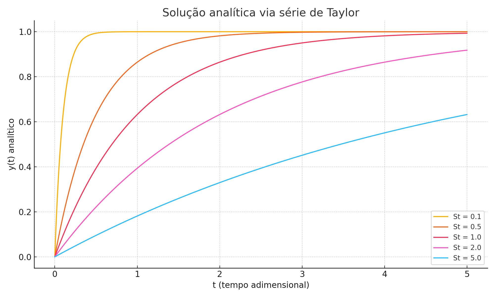

Em seguida, comparam-se os resultados da solução analítica com os
obtidos pelo método de RK4:

  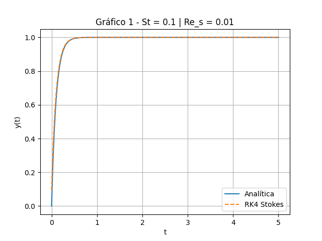

  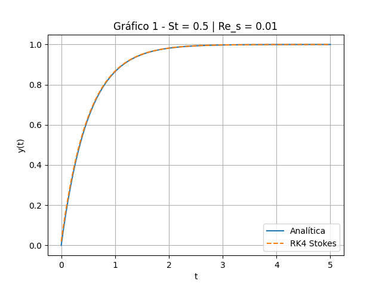

  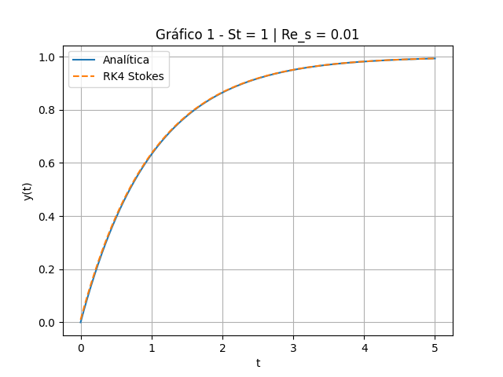

  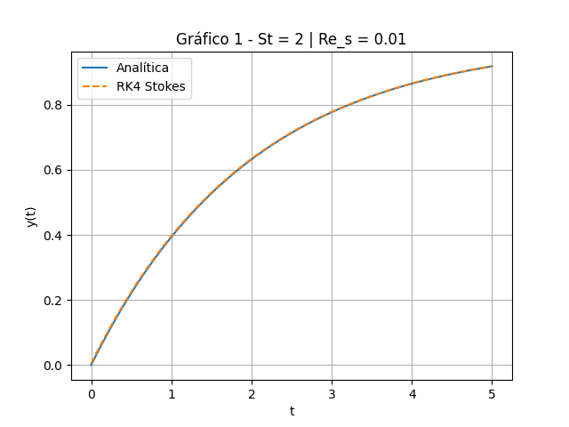

  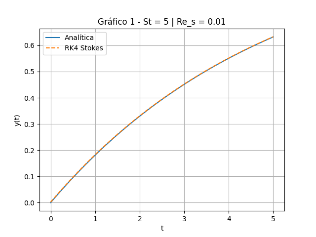

# Solução Numérica Linear --- RK4 (Stokes)

O método de Runge-Kutta de quarta ordem foi implementado para resolver a
EDO linear. A solução apresentou concordância com a solução analítica
para diferentes valores de $St$ e passos de tempo $h$.

  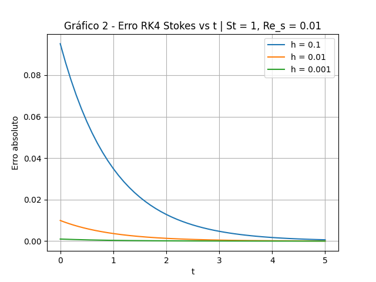

# Solução Numérica com Força Quadrática 

Para regimes com maior inércia, foi adicionada uma componente quadrática
à equação de movimento. O mesmo método de integração (RK4) foi aplicado,
com proteção contra overflows e divergências numéricas.

  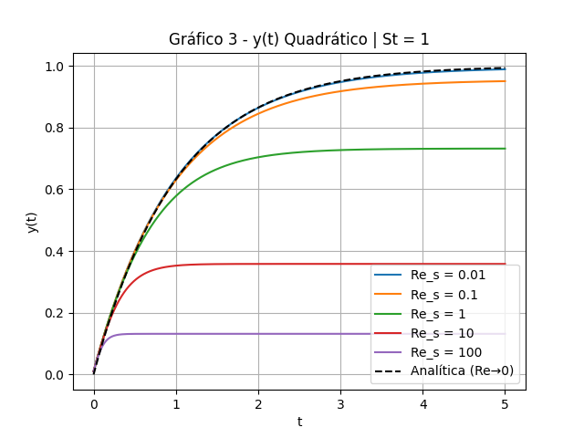

# Análise do Erro e Variação do Passo

Os gráficos seguintes comparam os erros relativos das soluções numéricas
em relação à analítica, conforme os parâmetros de malha temporal e
intensidade do termo quadrático.

  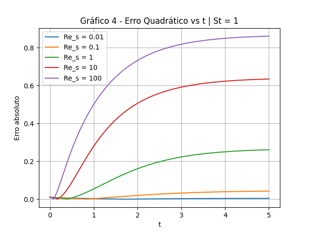

  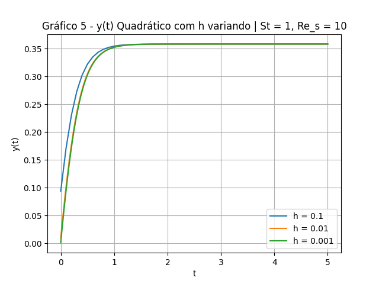

  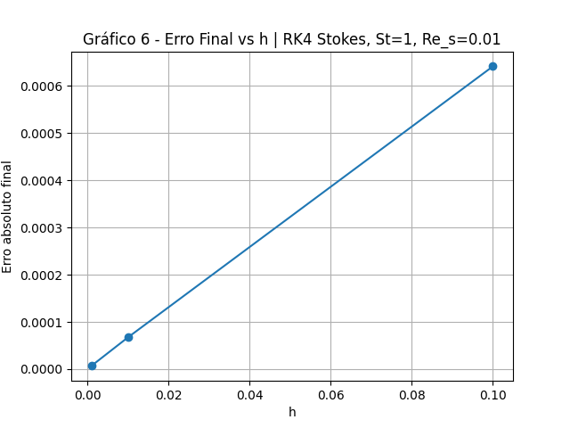

  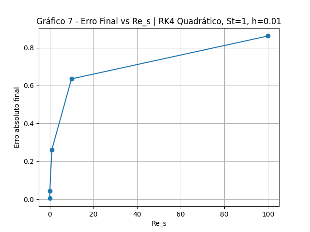

# 3.1 Validação com modelo de referência 

A solução numérica com força quadrática foi validada qualitativamente
pela comparação com a Figura 2 do artigo de Sobral et al. (2007), que
apresenta a solução exata da mesma equação adimensionalizada
implementada neste trabalho:

$$St \frac{dy}{d\tau} = 1 - y - \frac{Re_s}{2} y^2$$

A forma da curva gerada numericamente coincide com o comportamento da
solução exata descrita no artigo, especialmente para pequenos valores de
$Re_s$. Conforme o valor de $Re_s$ aumenta, observa-se um desvio
progressivo em relação à solução linear, conforme demonstrado na
simulação.

  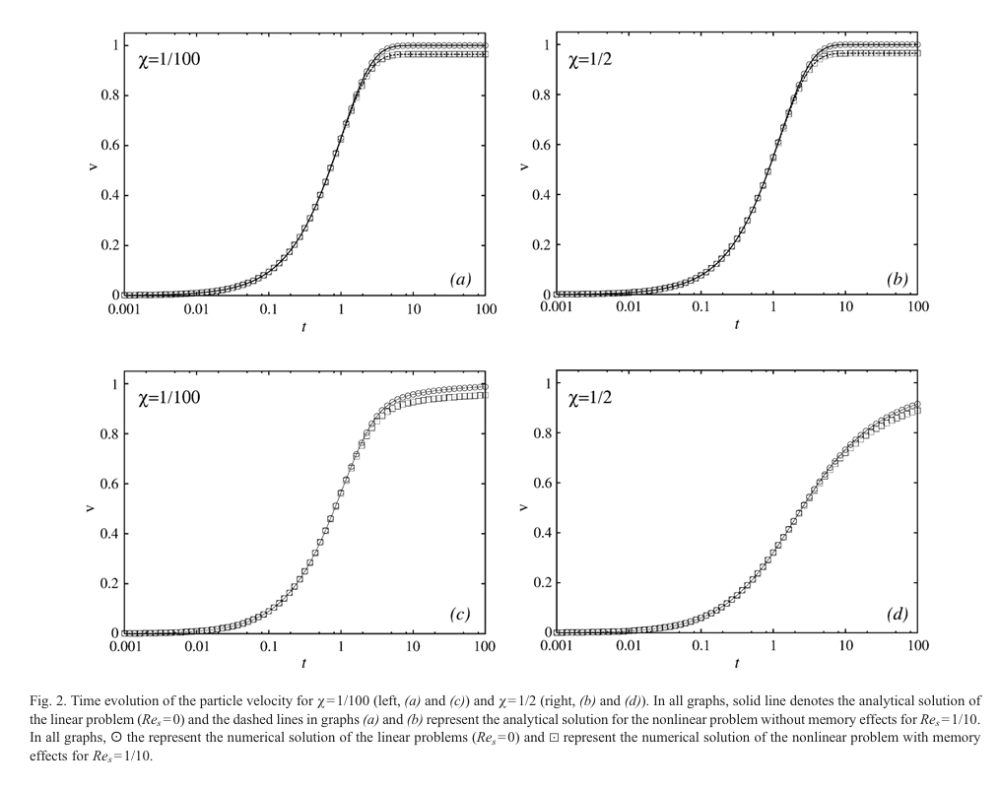

## 3.2 Efeitos da Força de Arrasto Quadrática

A força de arrasto em fluidodinâmica representa a resistência do fluido
ao movimento da partícula. No regime laminar (Stokes), essa força é
proporcional à velocidade ($F_D = 6 \pi \mu R v$). Entretanto, para
números de Reynolds mais elevados ($Re \gtrsim 1$), efeitos inerciais
passam a influenciar o escoamento, tornando necessária a inclusão de um
termo quadrático:

$$F_D = \frac{1}{2} C_d \rho_f A v^2, \quad \text{com } A = \pi R^2$$

Fisicamente, esse termo quadrático representa a transferência de
quantidade de movimento do fluido em resposta à velocidade da partícula.
A inclusão deste termo induz uma desaceleração mais pronunciada à medida
que $v$ aumenta, dificultando a aproximação à velocidade terminal.

No modelo adimensionalizado:

$$St \frac{dy}{d\tau} = 1 - y - \frac{Re_s}{2} y^2$$

os efeitos são:

- Para $Re_s \to 0$, o termo quadrático desaparece e recupera-se o
  modelo de Stokes;

- Para valores moderados de $Re_s$, o termo quadrático retarda a
  aproximação à velocidade terminal;

- Para $Re_s \gg 1$, o termo quadrático domina, achatando a curva e
  modificando o regime dinâmico;

Esse comportamento foi reproduzido numericamente e validado com os dados
de referência.

# 4. Conclusão

O estudo conduzido permitiu explorar a dinâmica de sedimentação de uma
partícula esferoidal em fluido viscoso sob diferentes condições de
regime de escoamento. A formulação analítica para o modelo linear de
Stokes serviu como base para interpretação do comportamento de
aproximação à velocidade terminal.

A implementação numérica via método de Runge-Kutta de quarta ordem
permitiu simular tanto o modelo linear quanto o modelo com força de
arrasto quadrática. Foram observados efeitos significativos da
introdução do termo quadrático: retardo na velocidade de acomodação,
alteração no valor da velocidade terminal, e comportamento assintótico
distinto para diferentes valores de $Re_s$.

A variação do passo de integração foi considerada, permitindo observar
a sensibilidade do erro em relação à discretização temporal. Notou-se 
que o erro absoluto é mais pronunciado nos instantes iniciais da simulação, 
principalmente para passos maiores, devido à rápida variação do gradiente da 
solução no início do movimento. À medida que o sistema se aproxima da 
velocidade terminal, a solução torna-se mais estável e o erro tende a se 
estabilizar, reduzindo sua taxa de crescimento. Ainda, a expressão analítica para
a velocidade terminal no caso quadrático foi derivada e comparada com as simulações,
destacando a influência crescente do arrasto inercial.

As simulações foram qualitativamente comparadas com soluções presentes
na literatura, evidenciando tendências compatíveis com o comportamento
descrito por modelos mais completos.
