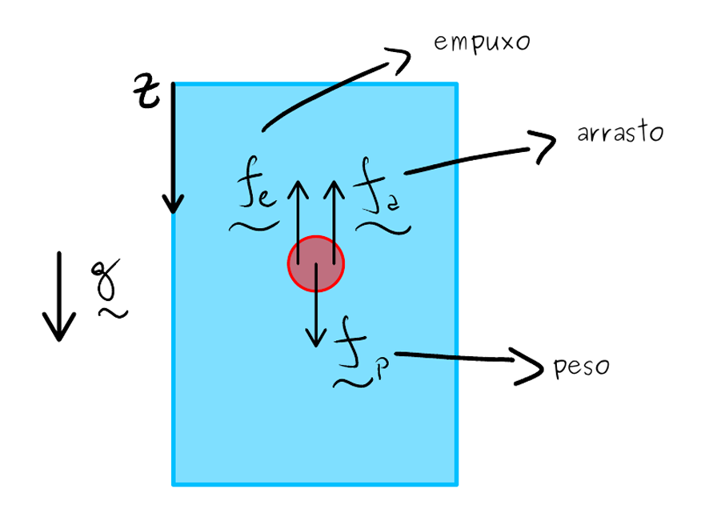
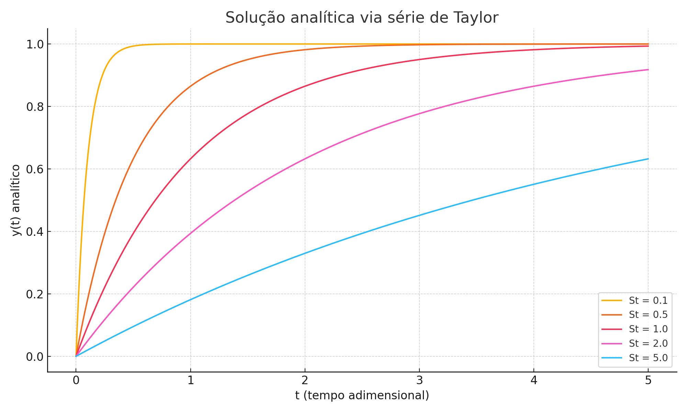
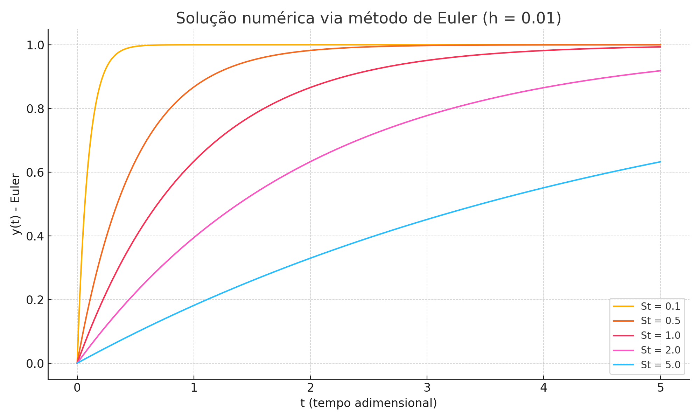
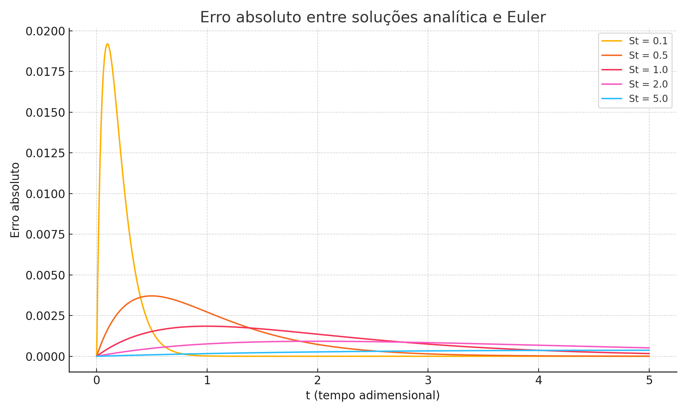

% Capa
\begin{titlepage}
    \centering
     

    \vspace{1cm}
    \Large Universidade de Brasilia 

    Departamento de Ciencias Mecanicas 

    Programa de Pos-Graduaçao 

    \vfill
    {\Large\bfseries Programa 1} 

    \vspace{0.5cm}
    **Disciplina: Metodos Numericos** 

    Professor: Rafael Gabler Gontijo 

    Data: \today 

    \vfill
    **Aluno: Eng. Lucas Wanick — Mestrando em Ciencias Mecanicas** 

    \vspace{0.5cm}
\end{titlepage}

# Introdu\c{cao ao Problema}
O presente estudo tem como objetivo simular a dinamica de uma particula esferoidal em um fluido viscoso, sob açao da força peso, empuxo e força de arrasto. A equaçao do movimento e baseada na segunda lei de Newton e contempla o modelo de arrasto linear (Stokes). A particula parte do repouso e tende a velocidade terminal ao longo do tempo. 

\begin{figure}[H]
    \centering
    
    \caption{Esquematizaçao do problema proposto pelo professor.}
\end{figure}

# Modelagem Matematica e Solu\c{cao Analitica}
O ponto de partida para a modelagem do problema {e} a aplicaçao da Segunda Lei de Newton a particula em movimento dentro de um fluido viscoso. Considerando a força peso, a força de empuxo e a força de arrasto linear (regime de Stokes), a equaçao do movimento {e} descrita por:

$$
    y(t) = 1 - e^{-t/St}
$$

A funçao exponencial foi implementada manualmente utilizando a serie de Taylor:

$$
    e^x = \sum_{n=0}^{\infty} \frac{x^n}{n!}
$$

Para manter a estabilidade numerica e evitar estouros por overflow ou underflow, utilizamos uma abordagem baseada na identidade:

$$
    e^{-x} = \frac{1}{e^x}
$$

A serie foi truncada automaticamente com base em um criterio de tolerancia de $10^{-15}$, o que assegura a convergencia da soluçao dentro de uma precisao aceitavel.

\newpage
## Trecho de codigo (solu\c{cao analitica via Taylor)}
```python
def exp_taylor(x, n=100, tol=1e-15):
    soma = 0.0
    termo = 1.0
    for i in range(n):
        soma += termo
        termo *= x / (i + 1)
        if abs(termo) < tol:
            break
    return soma

def exp_negativo(x):
    return 1 / exp_taylor(x)

def analytical(t, St):
    return 1 - exp_negativo(t / St)
```

# Implementa\c{cao do Metodo de Euler}
O metodo de Euler foi implementado explicitamente como aproximaçao da derivada por diferença progressiva:

$$
    y_{n+1} = y_n + h \cdot \frac{-y_n + 1}{St}
$$

O passo de integraçao adotado foi $h = 0{,}01$ para todos os casos, garantindo boa estabilidade e precisao numerica.

Utilizar uma abordagem numerica em paralelo a soluçao analitica e fundamental para validar a consistencia da simulaçao, principalmente em contextos onde a soluçao exata nao esta disponivel ou onde se deseja verificar a robustez de metodos aproximativos.

## Trecho de codigo (metodo de Euler)
```python
def euler_step(y, h, St):
    return y + h * (-y + 1) / St
```

# Analise do Erro
O erro absoluto foi calculado ponto a ponto pela diferença entre a soluçao numerica e a analitica:
$$
    \epsilon(t) = \left| y_{\text{Euler}}(t) - y_{\text{analitico}}(t) \right|
$$

# Resultados Graficos
\vspace{-1em}
\begin{figure}[H]
    \centering
    
    \caption{Soluçao analitica via serie de Taylor com tolerancia e reescrita.}
\end{figure}

\begin{figure}[H]
    \centering
    
    \caption{Soluçao numerica via metodo de Euler (h = 0.01).}
\end{figure}

\begin{figure}[H]
    \centering
    
    \caption{Erro absoluto entre a soluçao analitica e o metodo de Euler.}
\end{figure}

# Conclus{ao}  
A resoluç{a}o do problema proposto demonstrou ser plenamente vi{a}vel por meio de implementaç{o}es num{e}ricas diretas em \texttt{Python}, mesmo sem recorrer a bibliotecas prontas para o c{a}lculo da exponencial. A utilizaç{a}o da s{e}rie de Taylor truncada com crit{e}rio de toler{a}ncia mostrou-se eficaz e computacionalmente est{a}vel, desde que aliada a uma reescrita inteligente da exponencial para evitar problemas num{e}ricos associados {a} representaç{a}o em ponto flutuante (\texttt{float64}). A exportaç{a}o dos dados simulados para um arquivo \texttt{.csv} permitiu a posterior geraç{a}o de gr{a}ficos, favorecendo a visualizaç{a}o dos resultados e a comparaç{a}o entre as soluç{o}es anal{i}tica e num{e}rica. O estudo evidencia a robustez da abordagem proposta e reforça a aplicabilidade de m{e}todos computacionais simples na modelagem de fenomenos f{i}sicos com eficiencia e controle.

