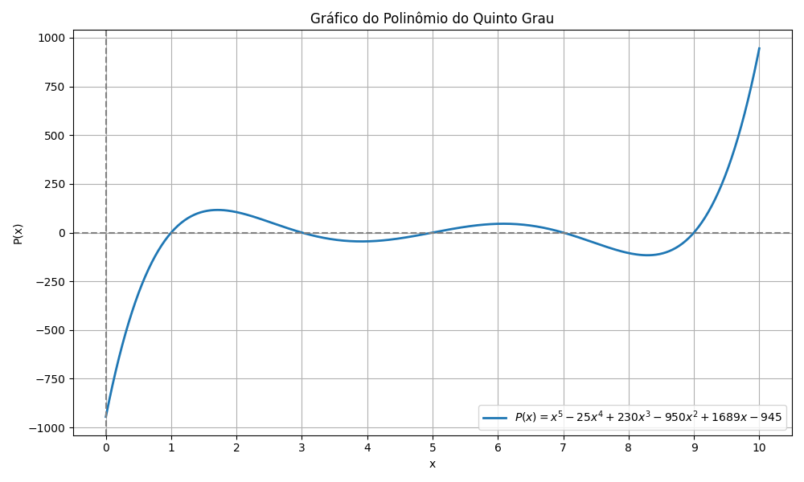
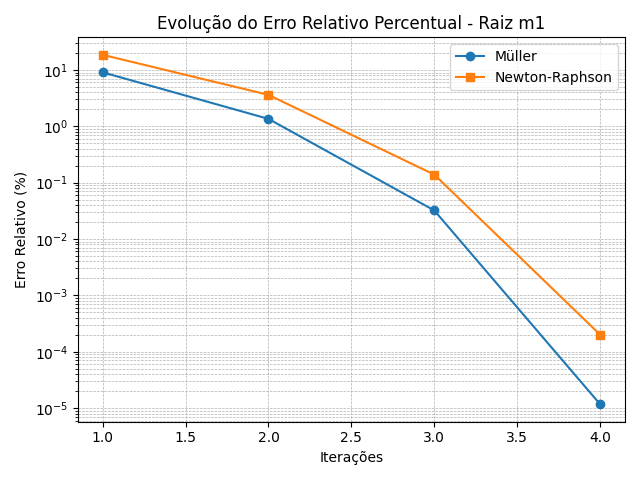
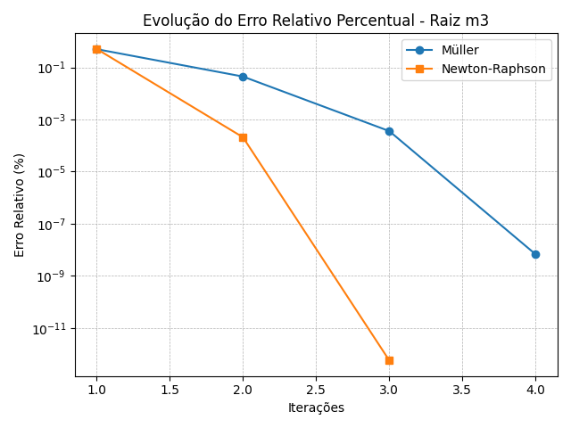
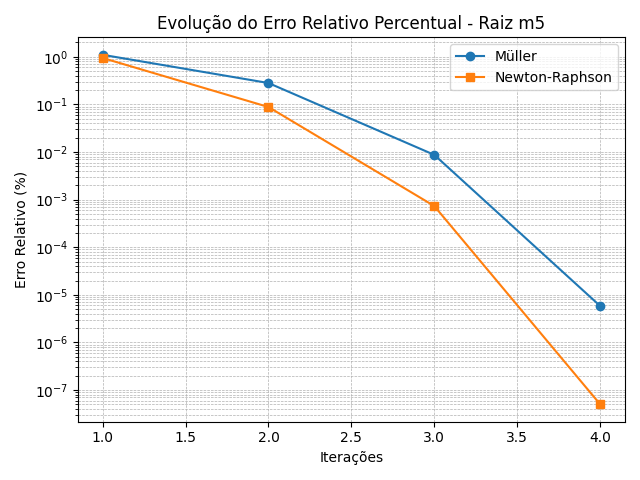

<p align="center">
  
</p>

**Universidade de Brasília**\
Departamento de Ciências Mecânicas\
Programa de Pós-Graduação\
**Programa 3**\
**Cálculo de Raízes: Métodos de Müller e Newton-Raphson**\
**Disciplina: Métodos Numéricos**\
Professor: Rafael Gabler Gontijo\
Data: 2025-04-21\
**Aluno: Eng. Lucas Wanick --- Mestrando em Engenharia Mecânica**\
:::

# Introdução 

A resolução de equações não lineares é um dos pilares da análise
numérica aplicada à engenharia. Métodos iterativos como Newton-Raphson e
Müller são amplamente utilizados por apresentarem robustez e
convergência rápida em problemas que não admitem solução analítica
direta. Este programa tem como objetivo aplicar, comparar e analisar os
métodos de Newton-Raphson e Müller na determinação das raízes reais do
polinômio:

$$P(x) = (x-1)(x-3)(x-5)(x-7)(x-9)$$

<p align="center">
  
</p>

# Objetivo

Implementar os métodos de Newton-Raphson e Müller para encontrar todas
as raízes reais do polinômio dado, a partir de chutes iniciais definidos
interativamente pelo usuário. Ao final, serão comparadas as evoluções do
erro relativo percentual de cada método para algumas raízes
selecionadas.

# Fundamentação Teórica

## Método de Newton-Raphson

Baseia-se na aproximação da função por sua reta tangente:

$$x_{i+1} = x_i - \frac{f(x_i)}{f'(x_i)}$$

O método converge rapidamente quando a derivada da função é
significativa e o chute inicial está suficientemente próximo da raiz.

## Método de Müller

Generaliza a interpolação quadrática de Lagrange e utiliza três pontos
consecutivos para projetar a raiz da parábola ajustada:

$$x_{i+1} = x_i + \frac{-2c}{b + \sqrt{b^2 - 4ac}}$$

Evita a subtração de termos próximos ao considerar o maior módulo no
denominador (raiz positiva), reduzindo o erro de cancelamento.

# Implementação

A implementação foi realizada utilizando a linguagem Python, com
objetivo de permitir ao usuário calcular as raízes reais de uma função
polinomial de quinto grau por meio dos métodos iterativos de
Newton-Raphson e de Müller. O polinômio fornecido no enunciado foi
expandido e derivado simbolicamente para viabilizar os cálculos das
iterações:

$$f(x)  = x^5 - 25x^4 + 230x^3 - 950x^2 + 1689x - 945$$

$$f'(x) = 5x^4 - 100x^3 + 690x^2 - 1900x + 1689$$

O algoritmo solicita ao usuário os valores dos chutes iniciais
$(x_0, x_1, x_2)$ necessários para o método de Müller. Com base nesses
valores, o código calcula a média aritmética como chute inicial para o
método de Newton-Raphson.

Essa abordagem visa garantir que ambos os métodos partam de uma mesma
vizinhança inicial para fins de comparação.

O código foi estruturado em três partes principais:

- **Definição das funções:** a função polinomial $f(x)$ e sua derivada
  $f'(x)$ são definidas separadamente, bem como as funções que
  implementam os métodos de Newton-Raphson e Müller, cada uma retornando
  a raiz estimada e a tabela de iterações.

- **Entrada interativa:** o usuário é orientado a fornecer os valores de
  chute para cada raiz no formato `x0,x1,x2`, um por vez. Caso algum
  valor inválido seja digitado, o programa exibe uma mensagem de erro e
  solicita nova entrada.

- **Execução e comparação dos métodos:** para cada conjunto de chutes,
  ambos os métodos são executados, os resultados são armazenados e uma
  tabela de iterações é exibida, contendo o número da iteração, a
  aproximação da raiz, o valor da função e o erro absoluto.

## Construção do Código e Estruturação Computacional

A seguir, destacam-se os principais blocos do código Python utilizados
na resolução do problema, divididos em três partes fundamentais: a
declaração dos métodos iterativos, a execução principal do programa e a
posterior plotagem dos erros relativos para fins de comparação entre os
algoritmos.

### 1. Declaração dos métodos

As funções $f(x)$ e sua derivada $f'(x)$ foram declaradas explicitamente
para permitir a utilização no método de Newton-Raphson. Em seguida, os
métodos `newton_raphson()` e `muller()` foram implementados. O primeiro
aplica a fórmula clássica com verificação da derivada nula, enquanto o
segundo segue o desenvolvimento algébrico do método de Müller com base
nos três últimos pontos.

``` {.python language="Python" caption="Método de Newton-Raphson"}
def newton_raphson(f, df, x, tol=1e-5, max_iter=100):
    iteracoes = []
    x0 = x
    for i in range(1, max_iter + 1):
        fx0 = f(x0)
        dfx0 = df(x0)
        if dfx0 == 0:
            return None, iteracoes
        x1 = x0 - fx0 / dfx0
        error = abs(x1 - x0)
        iteracoes.append((i+1, x1, f(x1), error))
        if error < tol:
            return x1, iteracoes
        x0 = x1
    return x0, iteracoes
```

``` {.python language="Python" caption="Método de Müller"}
def muller(f, x0, x1, x2, tol=1e-5, max_iter=100):
    iteracoes = []
    for i in range(max_iter+1):
        h0 = x1 - x0
        h1 = x2 - x1
        delta0 = (f(x1) - f(x0)) / h0
        delta1 = (f(x2) - f(x1)) / h1
        a = (delta1 - delta0) / (h1 + h0)
        b = a * h1 + delta1
        c = f(x2)
        delta = b**2 - 4*a*c
        if delta < 0 or a == 0:
            return None, iteracoes
        sqrt_delta = delta**0.5
        denom = b + sqrt_delta
        if denom == 0:
            return None, iteracoes
        x3 = x2 - (2 * c / denom)
        erro = abs(x3 - x2)
        iteracoes.append((i+1, x3, f(x3), erro))
        if erro < tol:
            return x3, iteracoes
        x0, x1, x2 = x1, x2, x3
    return x3, iteracoes
```

### 2. Execução do programa

Após a coleta dos chutes iniciais para o método de Müller, a média dos
três valores foi utilizada como entrada para o método de Newton-Raphson.
O programa executa ambos os métodos em sequência para cada uma das
raízes e exibe a tabela de iterações no terminal. O laço `for` percorre
os cinco conjuntos de chutes, identificando as raízes $m_1$ a $m_5$.

``` {.python language="Python" caption="Loop de execução dos métodos"}
for idx, (x0, x1, x2) in enumerate(chutes, start=1):
# Impressão das tabelas para Newton-Raphson e Müller
resultado += f"\n{'='*30} m{idx} {'='*30}\n"

    #Newton-Raphson
    chute_nr = (x0 + x1 + x2) / 3
    raiz_nr, iter_nr = newton_raphson(f, df, chute_nr)
    if raiz_nr is None:
        resultado += f"Newton-Raphson -> Falha para m{idx}.\n"
    else:
        resultado += f"Newton-Raphson -> A raiz m{idx} encontrada foi: {raiz_nr:.10f}\n"
        for i, x, fx, error in iter_nr:
            resultado += f"{i:<5}{x:>18.10f}{fx:>18.2e}{error:>18.2e}\n"
    
    #Müller
    raiz_muller, iter_muller = muller(f, x0, x1, x2)
    if raiz_muller is None:
        resultado += f"\nMüller -> Raiz complexa encontrada...
    else:
        resultado += f"\nMüller -> A raiz m{idx} encontrada foi: {raiz_muller:.10f}\n"
        for i, x3, fx3, erro in iter_muller:
            resultado += f"{i:<5}{x3:>18.10f}{fx3:>18.2e}{erro:>18.2e}\n"
            

...
print(resultado)
```

### 3. Plotagem dos erros relativos

Ao final da execução, o usuário pode optar por visualizar a convergência
dos métodos. O gráfico apresenta, em escala logarítmica, o erro relativo
percentual ao longo das iterações de ambos os métodos para as raízes
$m_1$, $m_3$ e $m_5$.

``` {.python language="Python" caption="Plotagem dos erros relativos"}
plt.plot(range(1, len(muller_erro) + 1), muller_erro, marker='o', label='Müller')
plt.plot(range(1, len(nr_erro) + 1), nr_erro, marker='s', label='Newton-Raphson')
plt.yscale('log')  # Escala logarítmica
plt.title(f"Evolução do Erro Relativo - m{idx}")
plt.xlabel("Iterações")
plt.ylabel("Erro Relativo (%)")
plt.grid(True, which='both', linestyle='--')
```

Esta visualização reforça as diferenças no comportamento de convergência
entre os dois métodos e evidencia os casos em que um algoritmo é mais
estável ou eficiente que o outro.

Adicionalmente, ao final da execução, o usuário pode optar por gerar
gráficos da evolução percentual do erro relativo (em escala
logarítmica), permitindo comparar a taxa de convergência de ambos os
métodos para diferentes raízes. Esses gráficos são gerados
exclusivamente para as raízes $m_1$, $m_3$ e $m_5$ a partir dos dados
obtidos nas iterações.

# Resultados

- As raízes reais identificadas foram: $x = 1$, $x = 3$, $x = 5$,
  $x = 7$ e $x = 9$.

- Os métodos convergiram em menos de 10 iterações para todas as raízes.

- Müller apresentou instabilidades para algumas raízes, exigindo ajuste
  fino dos chutes iniciais.

<p align="center">
  
</p>

<p align="center">
  
</p>

<p align="center">
  
</p>

# Conclusão

O desenvolvimento deste programa permitiu comparar de maneira
estruturada os métodos de Newton-Raphson e de Müller aplicados à função
polinomial:

Foram utilizadas cinco estimativas distintas de raízes reais, cujos
valores exatos são conhecidos. Os chutes iniciais utilizados para cada
raiz foram:

- m~1~: (0.5, 1.5, 2) $\rightarrow$ Raiz real: 1

- m~2~: (2.2, 3.0, 3.3) $\rightarrow$ Raiz real: 3

- m~3~: (4.7, 5.3, 6) $\rightarrow$ Raiz real: 5

- m~4~: (6.3, 7.0, 7.5) $\rightarrow$ Raiz real: 7

- m~5~: (8.6, 9.5, 10) $\rightarrow$ Raiz real: 9

O programa foi estruturado para apresentar as iterações de ambos os
métodos lado a lado, evidenciando a convergência de cada algoritmo para
cada raiz. Para reforçar a análise, implementou-se também uma
funcionalidade de plotagem dos erros relativos percentuais de cada
método em escala logarítmica, o que permitiu visualizar o comportamento
da convergência iterativa.

Foi desenvolvida, ainda, uma planilha em Excel para facilitar a
estimativa de chutes iniciais por meio da técnica de aproximação por
segmentos parabólicos.

Foram observadas dificuldades de convergência para as raízes m~2~ e
m~4~. Nessas regiões, o método de Müller demonstrou sensibilidade
acentuada à escolha dos chutes iniciais, o que levou, em diversas
tentativas, à convergência para raízes incorretas ou mesmo à geração de
raízes complexas. Isso evidencia a necessidade de uma aproximação mais
criteriosa nesses intervalos, especialmente quando a curvatura da função
induz múltiplas inflexões próximas.

Como atividade complementar, elaborou-se uma animação utilizando Python
e Matplotlib com atualização dinâmica da parábola interpoladora
utilizada no método de Müller (anim_f2(x).py). A visualização forneceu
uma compreensão mais intuitiva do funcionamento do algoritmo,
especialmente na aproximação da raiz ao longo das iterações.

Um dos aspectos mais interessantes observados foi que, embora o método
de Müller seja mais robusto --- já que independe do cálculo explícito da
derivada e consegue lidar com raízes complexas ---, em todos os cinco
casos, o método de Newton-Raphson apresentou \*\*convergência
ligeiramente mais rápida\*\* (menor número de iterações) ou equivalente,
mesmo com apenas um chute inicial. Essa eficiência pode ser explicada
pela suavidade e boa curvatura da função em torno das raízes, que
favorecem o método de Newton quando a derivada não se anula e os chutes
iniciais estão suficientemente próximos da solução.

Dessa forma, ambos os métodos demonstraram excelente desempenho para
este tipo de função, e sua aplicação conjunta proporcionou uma análise
rica e versátil do problema proposto.

**Link do repositório no GitHub:**\
`https://github.com/EngWanick/MetodosNumericos/Programa_3`\
[Repositório Eng.Wanick -
GitHub](https://github.com/EngWanick/M-todosNum-ricos/Programa_3)
